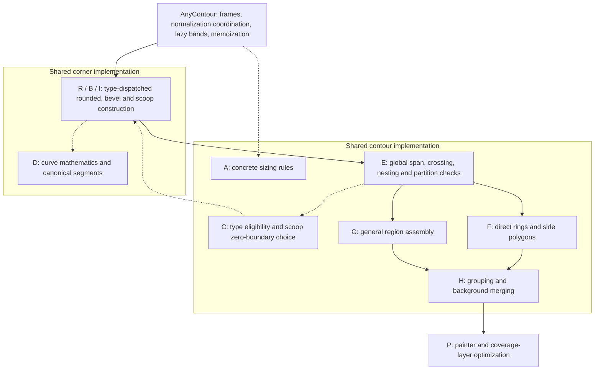
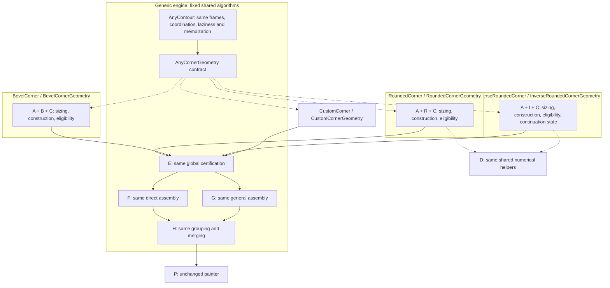

# Corner geometry in 2.0

## Geometry providers and engine ownership

Each descriptor selects a shared `const AnyCornerGeometry` implementation.
`RoundedCornerGeometry`, `BevelCornerGeometry`, and
`InverseRoundedCornerGeometry` own their corresponding sizing, construction,
boundary policy and eligibility conditions. Core geometry is a separate Dart
library whose dependency closure excludes concrete corners and the decoration
composition facade. Existing imports re-export the relocated public types.

The diagrams use matching letters for relocated code. A/C were interleaved
type-specific rules; they now live beside each family's construction code.
Arrows show requested work and helper consultation; unused bands stay lazy.

### Before the provider relocation



### Current provider architecture



There is no provider registry or configurable contour pipeline. The engine
consults each corner's selected provider and uses the same contour-wide rules
for mixed types. Source/parameter identities remain intact. Resolved results
carry lazily memoized local traits and optional opaque immutable provider state; new
arbitrary curves default to conservative eligibility. See
[CUSTOM_CORNERS.md](CUSTOM_CORNERS.md) for the precise contracts and migration.

The relocation preserves canonical control points and intervals, tolerances,
numerical limits, route choices and diagnostic counts. Characterization captures
all isolated fixtures, 22 indexed gallery examples at three tween positions,
and 66 local source/boundary combinations. Ownership samples and operation
counts are captured independently of the new trait representation. Existing
analytic, raster and forced-general comparisons remain in the suite; no goldens
were updated for this refactor.

## Provider relocation measurements (2026-09-16)

These measurements compare the existing optimized v2 implementation with the
provider relocation, separately from the earlier v1-style construction speedup
reported below. Both versions used Flutter 3.47.3 (`e8113bf456`), engine
`06a2e2a110`, Dart 3.13.3 and the Windows native Flutter test backend.

Five runs per version were interleaved, reversing pair order on alternate runs.
The saved baseline uses the same benchmark source and dependencies. Values are
milliseconds, reported as median (minimum–maximum), summed across each category.

| Native geometry workload | Before | Provider implementation |
| --- | ---: | ---: |
| Ordinary, original short warm-up | 1.030 (0.945–1.145) | 1.134 (1.018–1.194) |
| Fallback, original short warm-up | 10.066 (8.614–10.664) | 8.807 (8.611–9.176) |
| Full gallery, original short warm-up | 8.986 (8.425–9.699) | 9.192 (9.059–9.764) |
| Ordinary, settled JIT | 0.585 (0.555–0.622) | 0.603 (0.570–0.607) |
| Fallback, settled JIT | 7.070 (6.835–7.878) | 7.131 (6.924–9.837) |
| Full gallery, settled JIT | 5.458 (4.987–6.594) | 5.821 (5.168–5.983) |

The original protocol remains the default: two warm-up passes, 30 constructions
per isolated fixture and five tween positions per gallery example. Its ordinary
median increased 10.1%; identical short-warm-up timing is **not** claimed.
Investigation found that moving the hot functions changed warm-up sensitivity.
An initial eager-traits implementation also classified temporary curves; the
final implementation evaluates and memoizes traits only when requested.

To distinguish steady-state throughput, the same optional settled protocol was
applied to both versions: 1,000 complete fixture warm-up cycles and 300 samples
per fixture, plus 100 complete gallery warm-up cycles before the original three
reported passes. A separate sampled VM investigation over 10,000 ordinary
cycles measured 0.647 ms before and 0.642 ms after. It is retained as diagnostic
evidence, not substituted for the five-run comparison.

Settled medians are slightly higher, within overlapping observed spreads; these
runs do not establish a slowdown outside that variation or a speedup. No fallback
fixture has a consistent regression beyond its observed spread. Timing cannot
prove exactly zero overhead. Canonical geometry, ownership signatures and work
counts are unchanged, and the painter source is unchanged.

### Final Chrome comparison

The same six visible gallery animations were profiled using CanvasKit profile
builds, a 1087×727 CSS viewport and DPR 1.25. Each version has three eight-second
captures after eight seconds of warm-up. All captures contained active animation.

| Browser metric, ms | Before median (spread) | Provider median (spread) |
| --- | ---: | ---: |
| Per-run median animation callback | 6.586 (6.153–6.602) | 6.283 (6.075–6.369) |
| Per-run p95 animation callback | 8.898 (7.393–9.341) | 7.706 (7.582–7.813) |
| GPU-process command handling / presentation | 0.706 (0.635–0.761) | 0.710 (0.686–0.730) |
| Compositor paint submission / presentation | 0.120 (0.113–0.181) | 0.114 (0.113–0.118) |

The browser ranges overlap and show no sustained rendering regression. GPU
process durations are CPU command-processing measurements, not hardware GPU
execution times. Geometry timings are not frame-rate estimates.

The final suite passed **199 tests** with a clean analyzer. The standalone
CanvasKit runner passed **90 hole checks and 254,400 multi-fill coverage checks**
at DPR 1/2/3. No golden images or raster tolerances changed.

All final runs, per-fixture values, indexed gallery entries, browser version and
earlier diagnostic runs are retained in
[`provider_refactor_results.json`](test/benchmarks/provider_refactor_results.json).
Earlier diagnostic runs are explicitly marked as the initial extraction, not
the final implementation. To reproduce settled native measurements, use:

```sh
flutter test --dart-define=SETTLED_GEOMETRY_BENCHMARK=true test/benchmarks/animation_geometry.dart --reporter expanded
```

The Chrome runner also accepts `PROFILE_REVERSE=1` to counterbalance capture
order. These controls affect benchmark harnesses only; there is no public
rendering-performance switch.

## Coordinates and source definitions

The frame uses unit rays `u` (toward the previous vertex) and `v` (toward the
next), with material-facing normals separate from winding. Let θ be the smaller
angle between the rays, and let `A` be the linear map with `A(u)=p·u` and
`A(v)=n·v`.

A rounded source is `vertex + A(c + (cos φ, sin φ))`, where
`c=(u+v)/|cross(u,v)|` is the unit fillet center. Its contact lengths are
`p·cot(θ/2)` and `n·cot(θ/2)`. For `p=n=r` it is a circle of radius r.
An inverse source is the ray-bounded unit sector centered at the vertex,
transformed by A. A bevel connects `vertex+p·u` to `vertex+n·v`.

Rounded/scoop descriptors with a zero component have a sharp source area;
zero-size scoops remain sharp at the shifted vertex. A one-zero bevel retains
its endpoints. Collinear and backtracking tab helper vertices do not have a
fillet. An explicit boundary at a straight vertex uses one averaged shifted
anchor; automatic straight transitions and reversing tab helpers retain both
shifted side contacts. Duplicate unskipped vertices and non-finite points/widths are errors.

## Boundary policies

Each side supplies `inside=width·(1-align)/2` and
`outside=width·(1+align)/2`. Resolution receives **positive inward** signed
material distances. Inner and outer overrides are resolved independently.

For a convex box corner, shrinking rounded radii gives
`(p-insideNext, n-insidePrevious)`, clamped at zero. Ordinary growth gives
`(p+outsideNext, n+outsidePrevious)`. In the general frame these same changes
cancel the shifted vertex's ray coordinates, preserving the affine ellipse
center while radii stay positive. Reflex convexity reverses growth/shrinkage.

To keep rounded zero sharp, component growth by d uses:

```
grow(r,d) = r+d                          r >= d
grow(r,d) = r+d*(1+(r/d-1)^3)             0 <= r < d
grow(r,0) = r
```

The corresponding-axis rule and small-radius adjustment have a reference in
[W3C corner shaping](https://www.w3.org/TR/css-backgrounds-3/#corner-shaping).
The taper can move the ellipse center; center preservation is not promised
when the small-radius policy or collapse is active. `preserveRatio` uses a
common scale; `equal` retains dimensions at the shifted vertex.

Dynamic bevels intersect each shifted side with a source bevel line displaced
by that side's signed distance. Uniform distances therefore give a parallel
bevel at that perpendicular distance. `preserveRatio` uses one displacement
`(dPrevious/n + dNext/p)/(1/n+1/p)`. Unequal dynamic distances change slope;
these policies do not all claim a constant-distance offset.

Automatic scoops retain the source vertex `C` as their reference center. If the
source sector is `P(t)`, with material-facing unit normal `N(t)`, the boundary is
`Q(t)=P(t)+d(t)*N(t)`, where `d(t)=(1-t)*dPrevious+t*dNext`. Here `t` is the source
angular parameter. Equal distances produce a parallel curve; unequal distances
give a deliberate width transition. In general an elliptical parallel curve is
not an ellipse, so a pair of modified `p/n` values cannot represent it.

For a circle with equal distances, the radius is `r+convexity*d`: outer offsets
shrink a convex-vertex scoop and inner offsets grow it. `C` remains unchanged.
At a rectangular top-left corner, an inward offset `d` meets the shifted sides
at `(d,sqrt((r+d)^2-d^2))` and its transpose. Intersections trim the arc. Outward
side contacts use the source arc's endpoint tangent extensions, producing sharp
joins rather than extra round arcs. For an outside width `w<r`, the previous
join runs from `(-w,r-w)` to `(0,r-w)`, followed by the concentric arc. Uniform
normal distance is promised along surviving curved portions, not along miter
extensions at sharp contacts. Exhausted circular arcs collapse continuously to
the intersection of the offset endpoint tangents. A zero source stays sharp.

Explicit inverse descriptors instead use their own boundary's side-intersection
vertex as center and retain their authored dimensions. Each missing boundary
derives independently from the shape, even if the other boundary is explicit.

Explicit overrides author boundary shapes without a new containment rule.
Legacy `zeroBorder` uses the outer descriptor conversion policy; it is not an
inverse of every converter. For scoops, retain the outer curve's reference and
accumulate the return distance: an automatic outer scoop returns to the shape,
whereas an explicit outer scoop remains centered on its authored outer vertex
while its radius increases on the way to zero. Prefer `shapeBorder` for
source-independent clipping/backgrounds.

## Normalization and filled topology

Infinity is resolved against available source edges and the type's contact
formula. Each edge constraint contributes one proportional scale to both
components of its affected corners. Nonadjacent source intersections trigger a
further common scale until the source outline is simple. Widths and explicit
boundary overrides never change this shape normalization.

Automatic boundaries retain source area plus outward swept regions,
or source area minus inward swept regions as their definition. Certified simple
boundaries construct that same area directly; folded strips are decomposed and
Flutter PathOps performs the necessary unions and differences. Reversed straight spans
are not converted to positive available lengths. Already derived curves are
not resized to make a single contour survive. Interiors can be empty or have
multiple components.

Corner halves belong to their adjacent sides; a side takes the whole corner
when its neighbor has zero width. A painted partition connects the corresponding
outer and inner split points directly, without a detour through the shape.
Explicitly authored border fills are therefore independent of shape settings.
Certified side polygons are appended directly with consistent winding. General
side candidates are clipped to the final border area and made disjoint. Where collapsed distant sweeps overlap, the
first source side claims the overlap. Explicit bands retain their authored
outline semantics, including crossings with the opposite band.

Supported sources are simple resolved outlines and the existing tab helper
construction. General authored self-intersecting polygons are not supported.
`pathFor` returns the final filled area, whereas the public local corner
collections are inspection/partition geometry, not a topology assembler.

## Precision and representation

Canonical line/cubic segments drive point evaluation, tangents, complete paths
and side partitions. Partial cubics are obtained by de Casteljau subdivision,
not a fresh curve approximation. Each corner uses tolerance
`max(0.001, 1e-7*localExtent)` logical units.

Rounded sources, explicit inverse sources, automatic rounded boundaries, and
equal-offset circular scoops use direct cubic Hermite construction. Endpoints
and derivatives come from the analytic angular parameter. The number of equal
angular intervals is a power of two, selected so
`B * deltaAngle^4 / 384 <= tolerance / 4`, where `B` is the largest singular
value (maximum stretch) of the affine circle map. Adjacent segments reuse their
endpoint evaluations. This preserves the angular parameter, endpoint tangents,
and public line/cubic representation; partial paths still subdivide those same
canonical cubics exactly.

Elliptical and unequal-offset automatic scoops retain adaptive Hermite fitting,
checking interior samples with a quarter-tolerance budget. Flattening uses
control-hull flatness. Direct construction and fitting retain the 4096-segment
limit; adaptive fitting is bounded at depth 20 and flattening at depth 24.
Exceeding numerical limits throws `StateError`; no approximate fallback replaces
a rejected curve. Custom `resolve` and `resolveBoundary` implementations are honored.

Circular scoop/side intersections use analytic angular limits. Elliptical and
unequal-width scoop constraints use bounded brackets with bisection; the shifted
side-bisector intersection is included explicitly so a tiny surviving inward
arc cannot vanish merely because it falls between the regular brackets.

Folded swept polygons use a 1/4096-unit grid below the 0.001 tolerance to avoid
coincident-edge ambiguity in the native boolean engine. Ordinary strips retain
canonical curves. Native PathOps/rasterization still has floating-point and
antialias quantization; the tests distinguish analytic curve tolerances from
pixel coverage tolerances.

Boolean results explicitly use even-odd filling on web. Some CanvasKit versions
copy an operand's nonzero fill rule onto the result, filling ring holes and
covering backgrounds. Native PathOps keeps its reported fill rule. An engine
failure can retry equivalent operand order, normalization of the same filled
operands, or sequential sweep subtraction. First-side ownership can subtract
earlier original sweeps instead of their clipped union: within the target border
these remove exactly the same area. Retries run only after an engine rejection;
no failed region is discarded or replaced with an authored fallback.

Distinct ordinary source-over side fills accumulate premultiplied coverage in
a shared temporary layer before compositing. Built-in image-free colors and
gradients draw into it directly with additive premultiplied blending. Four
distinct solid sides therefore need one layer, previously five. Image-bearing
and custom fills retain their individual composition groups, including when
mixed with optimized fills. Image-before-base order, shader bounds, antialias
settings, painter reuse/disposal, and decoration effects are unchanged. Coverage
accumulation remains necessary for opaque antialiased sides too. Border layers
still composite normally with each other. A single fill and explicit
non-source-over blend modes retain their direct compositing semantics.

## Animation work

Corner boundaries are resolved lazily: reading the source clip does not derive
inner, outer, or legacy zero corners. Invisible border regions are not built.
Repeated flattening at the same precision reuses samples within the immutable
resolved corner; this memory is released with its contour. Tween contours still
bypass the shared decoration LRU cache.

Eligibility is memoized within each contour, separately for boundary bands and
side partitions. Rounded/bevel rectangles use provider-supplied local traits,
right angles, and surviving directed spans. Circular scoop boxes and simple
built-in polygons use canonical curve bounds and subdivision checks, nesting
witnesses, and split connectors. Automatic boundaries must also certify the
source-to-boundary strips: a simple final outline alone is insufficient.

Simple nested rings use opposite outer/inner winding with an explicit nonzero
fill rule. Side construction preserves zero-width neighbor ownership, and
disjoint equal-fill sides group by appending paths. Background merging uses
concatenation only when nonzero winding establishes the same union semantics.
A provably exhausted sharp rectangular inner area returns empty directly;
overlapping side ownership still uses the general route.

Noncircular automatic scoops, folds, reversed spans, helper vertices, uncertain
nesting, and unsupported custom geometry retain general assembly. Crossing
authored bands retain XOR semantics and are never resized into a safe outline.
General paths keep split components, first-side ownership, PathOps retries and
web fill-rule corrections. Source normalization remains independent of widths
and overrides. Classification resolves only bands needed by the requested area.
Empty accumulators are skipped for ordinary unions and grouping. Folded sweep
batches retain deliberate native normalization: omitting it made the existing
generated regression 280 return an incorrect subtraction without an exception.

Assertion-only diagnostics in `lib/src/geometry_diagnostics.dart` count fitting,
flattening, boolean operations, general assembly and painter layers. Scoped
test overrides force general assembly or the earlier painter using identical
resolved curves. They are not publicly exported and are inactive in profile and
release builds. No public switch or cache migration is introduced.

Run `flutter test test/benchmarks/animation_geometry.dart --reporter expanded`
to measure fresh tween geometry and final fill regions over 22 top-level gallery
examples at five intermediate times on the native Flutter test backend.
The report separates contour preparation from region construction and
warms up twice; it excludes GPU rasterization and is not a frame-rate guarantee.
Wall-clock thresholds are deliberately kept out of unit tests.

### Measured CPU results (2026-09-15)

Five separate warmed runs used the same Windows native Flutter test backend,
Flutter 3.47.3 (`e8113bf456`), engine `06a2e2a110`, and Dart 3.13.3. Each run
warms twice. Isolated fixtures average 30 fresh constructions; the gallery
averages five tween positions per indexed example. Values below are sums of
the respective workloads in milliseconds; spread is minimum–maximum.

| Workload | Before median (spread) | After median (spread) | Median reduction |
| --- | ---: | ---: | ---: |
| Seven ordinary fixtures | 7.056 (6.894–8.391) | 0.998 (0.953–1.071) | 85.9% |
| Four fallback fixtures | 9.967 (9.511–12.209) | 8.911 (8.671–9.347) | 10.6% |
| Full 22-example gallery | 21.305 (20.337–22.841) | 8.971 (8.670–10.502) | 57.9% |

Ordinary and aggregate before/after ranges do not overlap. No fallback fixture
has a consistent regression: median elliptical offsets improve 4.309→3.739 ms,
unequal scoop offsets 3.094→2.612 ms, collapsed rounded interiors 1.262→1.108 ms,
and split necks remain within noise at 1.401→1.341 ms. Full per-run data, including
every gallery index and title, is in
[`test/benchmarks/direct_construction_results.json`](test/benchmarks/direct_construction_results.json).
These CPU results do not measure achieved animation frame rate or GPU execution.

### Visible Chrome animation profile

The same six gallery examples (indices 0, 2, 3, 4, 6, 11) were rendered at
200×120 logical units with a repeating two-second forward/reverse animation.
Profile builds used CanvasKit and Chrome 152.0.7977.83, in a dedicated visible
window (1087×727 CSS viewport, DPR 1.25). Each version has three eight-second
captures, each warmed for eight seconds. Native-window occlusion throttling was
disabled; captures without active animation callbacks were rejected.

| Browser metric, ms | Before median (spread) | After median (spread) |
| --- | ---: | ---: |
| Per-run median animation callback | 20.099 (19.632–21.511) | 8.084 (8.003–8.659) |
| Per-run 95th-percentile animation callback | 23.793 (23.671–29.145) | 11.716 (9.898–13.509) |
| GPU-process command handling per presentation | 0.850 (0.820–0.946) | 0.837 (0.835–0.910) |
| Compositor paint submission per presentation | 0.159 (0.155–0.170) | 0.170 (0.166–0.178) |

Animation callbacks include geometry, widget/layout work and paint submission;
their median fell 59.8%. Rendering-command costs per displayed frame remain
similar within the observed spread. The latter are CPU durations in Chrome's
GPU process, not hardware GPU execution times. They do not establish a GPU
speedup. All values come from browser traces, separately from the native geometry
benchmark. Per-run measurements and browser version are included in the JSON
results linked above.

To reproduce, save before/after web profile builds of
`test/benchmarks/browser_animation.dart`, and a profile build of
`test/browser_fill_main.dart`. From `example/`, use:

```sh
flutter build web --profile --no-pub --no-wasm-dry-run -t ../test/benchmarks/browser_animation.dart --output ABSOLUTE_OUTPUT_DIR
flutter build web --profile --no-pub --no-wasm-dry-run -t ../test/browser_fill_main.dart --output ABSOLUTE_CHECK_DIR
```

Then from the repository root:

```sh
node test/benchmarks/chrome_profile.mjs BEFORE_DIR AFTER_DIR CHECK_DIR TRACE_OUTPUT_DIR
```

The dependency-free Node 24 runner serves local builds, uses an isolated Chrome
profile, saves screenshots and Chrome traces, runs the CanvasKit checks, and
closes its browser. `CHROME_PATH` can override the Windows Chrome executable;
`CHECK_ONLY=1` runs just the browser checks and `PROFILE_VARIANT=after` refreshes
only the after captures. These are benchmark harness settings, not public
decoration performance switches.

The gallery creates scroll rows on demand so offscreen examples do not all
rebuild and repaint on every tick. Recreated examples use the selected endpoint.

## Independent regression map

| Test file | Oracle / coverage |
| --- | --- |
| `corner_geometry_test.dart` | Reported box radii/centers, crossed-axis rounded fixture, bevel line equations, 60° circle, winding |
| `corner_matrix_test.dart` | 30°–150° convex/reflex circle and bevel equations, infinity, normalization, 1,000 seeded convex/concave outlines, rigid transforms |
| `corner_edge_cases_test.dart` | Ray-basis scoop equations and normals, converter policies, zero/near-collinear limits, immutable segments, threshold animation |
| `inverse_shape_corner_test.dart` | Shared/explicit centers, radial layer spacing, elliptical normal equations, sharp joins and inward trimming, collapse thresholds |
| `corner_topology_test.dart` | Concentric scoop and miter area oracle, split/empty interiors, side-region exact-once coverage |
| `corner_generated_regression_test.dart` | Promoted complete reproduction inputs for coincident compound sweeps and reversed-winding PathOps failures |
| `any_tab_decoration_test.dart` | Backtracking helpers preserve both side offsets; closing bottom edge remains painted |
| `authored_boundary_regression_test.dart` | Direct outer/inner split lines, explicit shape independence, zero-width ownership, reversed winding, straight-vertex anchors |
| `reported_examples_test.dart` | Actual mixed-corner, background and crown examples; circle/line equations, animated side coverage, DPR 1/2/3 captures |
| `corner_raster_test.dart` | Translucent seam coverage at DPR 1, 2, 3 |
| `corner_gallery_test.dart` | Layered/gradient/clipped curves, non-right vertices, split/empty interiors, tabs at DPR 1, 2, 3 |
| `multi_paint_test.dart` | Image/gradient layer order, primary clipping, effects once, image disposal, DPR 1, 2, 3 |
| `geometry_work_test.dart` | Lazy resolution call counts, read-only results, 180 seeded shortcut/general-path comparisons including collapsed bands |
| `example_animation_test.dart` | Intermediate rendered-widget states, offscreen disposal and endpoint restoration |
| `border_fill_test.dart` | Ring holes before/after translation, center/background pixels, portable browser cases |
| `direct_construction_test.dart` | Affine analytic error at extreme aspect ratios, direct/general area comparisons, 180 mixed authored cases, threshold frames, custom providers, multiple borders, deterministic work counts |
| `provider_characterization_test.dart` | Pre-relocation canonical geometry signatures, area/ownership samples and exact diagnostic counts |
| `corner_provider_test.dart` | Core dependency closure, independent public-API custom provider, mixed-type certification/fallback, normalization, interpolation and cache identity |
| `direct_paint_test.dart` | Optimized/previous painter pixels and layer counts for solids, varying-alpha gradients, images, image-plus-base, custom/mixed fills and explicit blend modes at DPR 1/2/3 |

The generator prints its seed, case number and complete input on failure. It
compares source geometry for all 1,000 cases, with final-area and additional
transform probes every twentieth case. Golden files are visual regressions;
analytic geometry and filled-area assertions establish correctness first.
Plain asynchronous image tests encode PNG bytes before `matchesGoldenFile`;
this avoids hiding comparator failures inside the widget binding's `runAsync`.

`test/browser_fill_main.dart` is a standalone browser check sharing numeric
pixel assertions with the native suite. It checks solid colors, gradients,
image clips, and backgrounds with shadows for all three corner types at DPR
1, 2, and 3. From `example/`, run:

```sh
flutter run -d chrome -t ../test/browser_fill_main.dart
```

This does not depend on the browser host provided by `package:test`, so it can
also verify CanvasKit on SDK installations whose browser test host fails to
load. Success reports the 90 border-hole checks and additional multi-fill
coverage checks. The latter include independent varying-alpha gradient values
and translucent seam coverage. Failures display their complete case and
expected/actual pixel values.

CanvasKit on the measured Chrome backend retains a diagonal seam coverage
deficit at DPR 3 in both grouped and optimized painting (for example, alpha 111
where ideal coverage is 128). This is separate from the layer optimization.
Browser checks compare the entire optimized and grouped images in premultiplied
RGBA, including those seam pixels, and assert independent alpha inside each
side. Native tests continue to assert constant alpha across the entire seam
with the existing six-level tolerance. This refactor does not claim to fix that
backend-specific rasterization limitation.

## Reviewed raster changes

The direct-construction refactor changes six individually inspected golden files;
no golden tolerances were relaxed. `corner_geometry_1x/2x/3x.png` change
165/286/389 edge pixels respectively (0.06%/0.03%/0.02%), localized to the
rounded and bevel triangles; maximum channel deltas are 39/22/43 at those edges.
Direct outlines bypass native PathOps normalization
and tessellation, changing edge coverage while boundary probes on both sides
agree within 0.001 logical units. `reported_examples_1x/2x/3x.png` change
11/13/25 pixels, with maximum channel differences 3/2/4, in the rounded examples.
The scoop, crown, tab, split-interior and multiple-border visuals remain intact.
The new painter comparison permits at most two channel levels for varying-alpha
gradients because eliminating an intermediate 8-bit surface removes one rounding
step; existing raster and numerical tolerances are unchanged.
