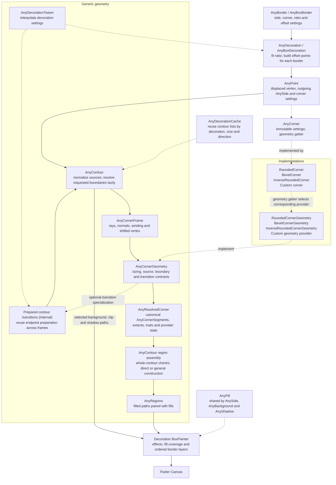

# any_borders

[](https://github.com/andry-brill/a-borders/actions/workflows/test.yml)

A Flutter package for shapes with independent side widths, aligned borders,
custom corners, layered fills, and shadows.


## Quick start

Add `any_borders` to your dependencies:

```sh
flutter pub add any_borders
```

```dart
import 'package:any_borders/any_borders.dart';
import 'package:flutter/material.dart';
```

Use `AnyBoxDecoration` anywhere Flutter accepts a `Decoration`:

```dart
Container(
  width: 180,
  height: 96,
  decoration: const AnyBoxDecoration(
    border: AnyBoxBorder(
      sides: AnySide(
        color: Color(0xFF2E685F),
        width: 12,
        align: AnySide.alignCenter,
      ),
      corners: RoundedCorner(radius: 24),
    ),
    background: AnyBackground(color: Color(0xFF85AEA8)),
  ),
)
```

## How the core works

`AnyDecoration` describes an outline as points and border settings. The generic
engine resolves local corner geometry, assembles filled regions, and passes them
to the painter. Each corner selects its geometry provider; core code depends on
the shared contract and never imports concrete corner implementations.



Solid arrows show construction and data flow; dotted arrows show configuration,
provider implementations, and reuse. Frames, edge allocation, curve mathematics,
contour checks, region assembly, and painting are fixed shared mechanics.
Providers supply local corner behavior through the contract; there is no
registration step or configurable optimization pipeline.

## Border configuration

`AnyBorder` supplies defaults for a decoration's points. `AnyBoxBorder` adds
per-edge and per-corner settings for rectangular outlines.

| Setting | Meaning | Box-specific overrides |
| --- | --- | --- |
| `sides` | Default edge width, alignment, and fill | `left`, `top`, `right`, `bottom`; `horizontal` falls back for top/bottom, `vertical` for left/right |
| `corners` | Source shape corners | `topLeft`, `topRight`, `bottomRight`, `bottomLeft` |
| `outerCorners` | Optional independently authored outer boundary | `outerTopLeft`, `outerTopRight`, `outerBottomRight`, `outerBottomLeft` |
| `innerCorners` | Optional independently authored inner boundary | `innerTopLeft`, `innerTopRight`, `innerBottomRight`, `innerBottomLeft` |
| `ratio` | Width/height ratio fitted inside the paint bounds | `shape` offers `AnyBoxShape.rectangle`, `square`, `circle`, and `pill` presets |
| `offset` | Signed path displacement, added to the decoration's offset | Applies to every edge of this layer |

An omitted inner or outer corner derives independently from the normalized
source shape. An explicit override affects only its own boundary. `circle` and
`pill` use infinite rounded source dimensions; `circle` and `square` set ratio 1.

`AnySide` describes the edge from one point to the next. Its `width` is the
thickness; `align` ranges from `alignInside` (`-1`, the default), through
`alignCenter` (`0`), to `alignOutside` (`1`). Inside and outside distances are
`width * (1 - align) / 2` and `width * (1 + align) / 2` respectively.

```dart
const AnyBoxDecoration(
  border: AnyBoxBorder(
    sides: AnySide(color: Color(0xFF2E685F), width: 8),
    top: AnySide(color: Color(0xFF2E685F), width: 16),
    right: AnySide(color: Color(0xFF2E685F), width: 24),
    corners: RoundedCorner(radius: 20),
    outerTopLeft: BevelCorner(radius: 28),
  ),
  background: AnyBackground(color: Color(0xFF85AEA8)),
)
```

### Path offsets

`AnyDecoration.offset` and `AnyBorder.offset` are finite doubles in logical
units, both defaulting to `0.0`. Each layer uses their sum:

```text
effective offset = decoration.offset + border.offset
negative = inset       zero = unchanged       positive = outset
```

Each layer fits its ratio, then passes the effective offset to `buildPoints`.
The builder moves the outline's vertices before corners are normalized and
resolved. Corner settings keep their meaning: a rounded radius of 20 remains
20 after an outset or inset, unless normal fitting must reduce it to fit the
available edges. Offset does not change layout size; an outset can extend
beyond the widget's bounds.

For a box, moving its four straight edges is equivalent to inflating its fitted
rectangle. Other outlines need their own point construction: for example,
a diamond's sloping edges move perpendicularly and meet at new vertices.
Inflating a diamond's bounding rectangle by the same amount is not equivalent.
[Custom decorations](#custom-decorations) can use `offsetPoints` for polygonal
outlines or implement their own construction rules.

Border widths and alignment are measured from the newly constructed source.
Only border distances reach corner providers; the path offset is not added to
those distances. Explicit inner/outer settings and `zeroBorder` keep their
usual policies. A box inset that exhausts its width or height returns no points,
so all its paths and painted regions are empty.

Use different layer offsets to separate strokes. A zero-width primary layer
can give the background, clip, and shadows a path independent of painted borders:

```dart
const AnyBoxDecoration.multi(
  offset: -4,
  primaryBorderIndex: 0,
  borders: [
    AnyBoxBorder(corners: RoundedCorner(radius: 20)), // Effects: inset 4.
    AnyBoxBorder(
      offset: 12, // Effective outset 8.
      corners: RoundedCorner(radius: 20),
      sides: AnySide(width: 4, color: Color(0xFF1565C0)),
    ),
    AnyBoxBorder(
      offset: -4, // Effective inset 8.
      corners: RoundedCorner(radius: 20),
      sides: AnySide(width: 2, color: Color(0xFF2E685F)),
    ),
  ],
  background: AnyBackground(color: Color(0xFFE3F2FD)),
)
```

### Multiple borders

Base, box, and tab decorations support const `.multi(...)` constructors:

```dart
const AnyBoxDecoration.multi(
  primaryBorderIndex: 0,
  borders: [
    AnyBoxBorder(
      corners: RoundedCorner(radius: 20),
      sides: AnySide(width: 4, align: AnySide.alignOutside,
          color: Color(0xFF1565C0)),
    ),
    AnyBoxBorder(
      corners: RoundedCorner(radius: 20),
      sides: AnySide(width: 2, align: AnySide.alignOutside,
          color: Color(0xFFFFFFFF)),
    ),
  ],
  background: AnyBackground(color: Color(0xFFE3F2FD)),
)
```

Borders paint in list order, each fitted independently into the same paint size.
In this example, white covers the inner two pixels of the blue stroke, leaving
two visible blue pixels and two white pixels. Layers overlap and composite
normally; their placement is independent of preceding layers.

`primaryBorderIndex` selects the layer supplying background, clip, and shadow
paths. Effects paint once before border layers. Primary selection changes
neither paint order nor the other layers' silhouettes. `border` returns the
primary border; `borders` exposes a read-only ordered view.

Keep supplied lists immutable after construction. The list must be nonempty and
the primary index in range; use a zero-width single border for a background-only
decoration. Single-border and equivalent one-entry multi decorations compare
equally.

## Corners

`AnyCorner` is an immutable descriptor. `p` belongs to the ray toward the
previous vertex and `n` to the ray toward the next vertex. When reversing an
outline, swap `p`/`n` and move side settings to their corresponding reversed edges.

| Corner | Meaning of `p` / `n` | Contacts along the rays at angle θ |
| --- | --- | --- |
| `RoundedCorner` | Ray-based scales of a unit circular fillet | `p * cot(θ/2)`, `n * cot(θ/2)` |
| `BevelCorner` | Straight-cut distances | `p`, `n` |
| `InverseRoundedCorner` | Ray-based scales of a circular sector centered at the vertex | `p`, `n` |

Here θ is the smaller angle between the incident rays; winding and convexity are
tracked separately. Equal dimensions produce circular rounded and inverse-rounded
sources, including at non-right angles.

```dart
const RoundedCorner(radius: 24)
const RoundedCorner.elliptical(p: 40, n: 16)
const BevelCorner(radius: 24)
const InverseRoundedCorner.elliptical(p: 32, n: 18)
```

Elliptical forms use the two incident rays as their basis. Outside right-angle
frames, `p` and `n` need not be the ellipse's principal semiaxes. Rounded and
inverse-rounded sources are sharp when either component is zero; a bevel with
one zero component retains its other contact.

Rounded and bevel corners accept a `CornerConverter` policy:

| Policy | Boundary behavior |
| --- | --- |
| `dynamicRatio` (default) | Adjust components independently; bevels intersect displaced lines |
| `preserveRatio` | Preserve rounded proportions; use one weighted parallel bevel |
| `equal` | Keep authored dimensions at the shifted vertex |

These are shape-design policies. The [geometry section](#geometry) describes
their construction and the normal-offset policy for inverse-rounded corners.

## Fills, backgrounds, clipping, and shadows

`AnyFill` is shared by `AnySide`, `AnyBackground`, and `AnyShadow`:

| Field | Effect |
| --- | --- |
| `color` | Solid base fill |
| `gradient` | Gradient base fill, taking precedence over `color` |
| `image` | `DecorationImage` painted before the base fill |
| `blendMode` | Blend mode for the base paint |
| `isAntiAlias` | Path antialiasing, enabled by default |

Custom fill implementations can use `MAnyFill` for `hasFill`, `hasBaseFill`,
`isSameAs`, and `createBasePaint`.

```dart
const AnySide(
  width: 20,
  align: AnySide.alignOutside,
  gradient: LinearGradient(
    colors: [Color(0xFF85AEA8), Color(0xFF2E685F)],
  ),
)
```

`AnyBackground.shapeBase`, `AnyDecoration.clipBase`, and
`AnyDecoration.shadowBase` each select an `AnyShapeBase` on the primary border:

| Base | Selected area |
| --- | --- |
| `shapeBorder` (default) | Source corners resolved on the layer's displaced outline |
| `outerBorder` | Outside boundary of the aligned sides |
| `innerBorder` | Inside boundary of the aligned sides |
| `zeroBorder` | Boundary derived back from the resolved outer corners using their conversion policy |

`zeroBorder` can differ from `shapeBorder` when outer overrides or conversion
policies affect the return path. `getClipPath` supplies the selected clip to
Flutter; use it with the clipping behavior of the surrounding widget.

The decoration's `shadows` list accepts `AnyShadow` values. In addition to fill
settings, a shadow provides `blurRadius`, two-axis `spreadRadius`, `offset`,
and `style` (`BlurStyle`). `offsetClip` controls whether an inner/outer/solid
shadow's clipping or cutout path follows its offset.

Within a border, distinct source-over fills share a coverage layer so adjacent
antialiased regions combine correctly, including opaque colors. Built-in
image-free colors and gradients draw directly into it with additive premultiplied
blending: four distinct solid sides use one temporary layer. Image-bearing and
custom fills also use individual composition groups. A single fill or explicit
non-source-over blend mode uses direct compositing. Image painters are reused
and disposed with the decoration painter.

CanvasKit on the measured Chrome backend has a diagonal coverage deficit at
DPR 3 with both grouped and direct-to-coverage painting—for example, alpha 111
where ideal coverage is 128. Browser regressions check agreement between those
routes and independent interior alpha; native regressions also check seam alpha.

## Geometry

### Source normalization and boundary policies

Sources must form a simple resolved outline; collinear and backtracking tab
helpers are supported. Skip duplicate vertices. Non-finite points or widths,
unskipped duplicate vertices, and arbitrary authored self-intersecting source
outlines are invalid.

The engine allocates physical edge contacts, resolves positive infinity against
available edges, and scales both dimensions of an affected corner proportionally.
Nonadjacent source-corner crossings trigger a further common reduction.
Allocation uses the points returned by the builder, including any path offset.
Border widths and explicit boundary overrides do not affect source normalization.
Derived curves are trimmed or collapsed according to their policy, rather than
rescaled to force a surviving outline.

Boundary distances are signed along material-facing normals: positive inward,
negative outward. Automatic construction uses these policies:

- **Rounded:** at a convex box corner, the next side changes `p` and the previous
  side changes `n`. Shrinkage clamps at zero; growth tapers near zero to keep the
  sharp limit continuous. Unequal widths can produce an elliptical boundary
  around a circular source.
- **Bevel:** intersect shifted sides with displaced bevel lines. Equal dynamic
  distances give a parallel bevel; unequal distances can change its slope.
- **Inverse rounded:** retain the source vertex as the reference center and
  offset along source normals. Equal-distance circular scoops are concentric:
  radius `r-d` outside and `r+d` inside at a convex vertex. Elliptical offsets
  are parallel curves, which need not be ellipses. Unequal distances interpolate
  over the source angular parameter. Side intersections trim the arc; outward
  contacts use straight tangent joins. Exhausted arcs become sharp joins.
  Uniform normal spacing applies to the surviving curve, not the join extensions.

Explicit inner/outer scoops retain their authored dimensions and use their own
boundary's side-intersection vertex as center. Outer-derived zero scoops keep
their reference curve and accumulate return distances. Parallel helper vertices
have no fillet: automatic transitions and reversing helpers retain both shifted
contacts, while an explicitly authored straight-vertex boundary uses one
averaged shifted anchor.

### Direct construction and general assembly

Local corner guarantees allow the engine to consider direct construction;
whole-contour checks determine whether a requested area qualifies. Rectangular
checks use right angles and surviving directed spans. Broader candidates use
canonical curve bounds and subdivision checks for simplicity, nesting, and
noncrossing split connectors. Automatic boundaries also require valid,
nonoverlapping source-to-boundary strips.

Certified nested rings use opposite outer/inner winding and nonzero filling.
Side polygons connect corresponding outer and inner corner splits directly.
Each side owns its adjacent corner half, or the whole corner when its neighbor
has zero width. Disjoint equal-fill paths are appended together. Background
merging uses this shortcut only when the fill semantics establish the same union.
A provably exhausted sharp rectangular interior returns an empty area directly.

Folds, reversed spans, uncertain contacts or nesting, helper configurations,
noncircular automatic scoops, and custom geometry without the necessary
guarantees use general assembly. Automatic areas follow source area plus outward
sweeps or minus inward sweeps, so interiors can empty or split into components.
General side candidates are clipped to the final area; the first source side
owns overlapping distant sweeps. Independently authored crossing boundaries
retain XOR fill semantics and their authored dimensions.

PathOps retries use equivalent operand order or filled-area operations after an
engine rejection. Boolean results receive a web fill-rule correction to retain
holes. Failed geometry is never silently discarded or replaced with an
approximate outline.

### Canonical curves and precision

`AnyResolvedCorner` stores immutable canonical `AnyCornerSegment` lines/cubics
with parameter intervals. Point evaluation, tangents, full paths, and side pieces
all use these same segments; partial cubics use exact de Casteljau subdivision.
Corner tolerance is `max(0.001, 1e-7 * localExtent)` logical units.

Rounded sources and boundaries, explicit inverse sources, and equal-offset
circular scoops use direct cubic Hermite construction from analytic endpoints
and derivatives. A power-of-two interval count satisfies
`B * deltaAngle^4 / 384 <= tolerance / 4`, where `B` bounds the affine circle
map's maximum stretch. Adjacent segments share endpoint evaluations.

Elliptical and unequal-offset automatic scoops use adaptive fitting and bounded
intersection searches. Construction allows at most 4096 segments, fitting depth
20, and flattening depth 24. Exceeding a numerical limit throws `StateError`.
Folded swept polygons use a 1/4096-unit grid, below the minimum curve tolerance,
to avoid coincident-edge ambiguity; ordinary strips retain canonical curves.
Raster coverage also depends on backend floating-point and pixel quantization.

### Inspecting geometry

`buildContours(size, direction)` returns all contours in paint order;
`buildContour(size, direction)` returns the primary contour. Their
`shapeCorners`, `outerCorners`, `innerCorners`, and `zeroCorners` expose local
resolved geometry:

```dart
final contour = decoration.buildContour(size, TextDirection.ltr);
final corner = contour.shapeCorners.first;
final contact = corner.previousExtent;
final midpoint = corner.pointAt(0.5);
final tangent = corner.tangentAt(0.5);
final path = Path();
corner.appendTo(path, from: 0, to: 0.371, moveTo: true);
corner.appendTo(path, from: 0.371, to: 1);
final innerArea = contour.pathFor(AnyShapeBase.innerBorder);
```

`source` identifies the normalized, undisplaced source descriptor; nullable
`parameters` describes the resolved curve when a descriptor can represent it.
Automatic offset scoops have
null parameters because their center, trimming, and joins require more state.
Their `center` reports the source reference center, and `circleRadius` reports
the circular radius when applicable. Use `pathFor` for the final filled area;
concatenating local corners does not assemble collapsed or split topology.

The example app's **Inspect corners** view displays boundaries, centers,
tangents, unequal widths, and mixed alignments.

## Custom corners

Extend `AnyCorner` for settings and `AnyCornerGeometry` for construction. Return
a shared, stateless provider from the required `geometry` getter. The built-in
pairs are `RoundedCorner` / `RoundedCornerGeometry`, `BevelCorner` /
`BevelCornerGeometry`, and `InverseRoundedCorner` /
`InverseRoundedCornerGeometry`. All contracts and providers are exported by
`package:any_borders/any_borders.dart` and `package:any_borders/any_contour.dart`.

The complete [NotchCorner example](example/lib/custom_corner.dart) implements
two line segments with an intermediate bend. It uses only public APIs and has
[tests](test/corner_provider_test.dart) covering mixed built-in/custom contours,
normalization, interpolation, and direct/general assembly. Its boundary policy
keeps cut lengths at the shifted vertex; it does not claim a constant-distance
offset.

### Descriptor and sizing contract

Implement `copyWith`, `lerpTo`, equality, and `hashCode`, preserving every extra
field that affects geometry or provider selection. The inherited scaling
operator scales `p`/`n` through `copyWith`; override it if additional dimensions
also need scaling. Zero must be a valid sharp limit.

`contactScale(corner, frame)` defaults to 1. The fixed linear allocator uses
`p * contactScale` and `n * contactScale` as edge consumption. For nonparallel
frames, the scale must be finite, positive, and compatible with proportional
scaling. `retainsSingleZeroExtent` defaults to false; set it to true if one
nonzero component still consumes its edge when the other is zero, as for bevels.

`AnyCorner.resolve()` and `resolveBoundary()` are nonvirtual forwarding
conveniences. Construction hooks belong on the provider:

| Provider hook | Responsibility |
| --- | --- |
| `resolve(corner, frame)` | Build source geometry for the normalized descriptor |
| `buildBoundary(source, parameters, shifted, previousDistance, nextDistance)` | Build an automatic boundary after shared zero-distance and parallel-frame handling |
| `resolveBoundary(source, ...)` | Override only when those shared early returns also need a different policy |
| `resolveZeroBoundary(outer, ...)` | Continue an outer-derived zero boundary; the default reconstructs the outer descriptor and applies return distances |

The boundary hook receives the original resolved source, descriptor parameters,
and an already shifted frame. Preserve the source identity needed by the policy
when constructing derived geometry. Put immutable continuation data in
`AnyResolvedCorner.geometryState` if descriptor parameters are insufficient;
the core stores it without inspecting its concrete type.

### Construction helpers

Supply finite, ordered segments covering `[0, 1]` without gaps; adjacent
endpoints must agree within tolerance. `AnyResolvedCorner(...)` copies and
validates arbitrary segment input and defaults to conservative eligibility.
Build one canonical curve per result so shared subdivision determines side
ownership.

Protected provider helpers offer the same mechanics used by built-ins:

- `resolveDegenerate` handles finite dimensions, parallel frames, and the
  provider's zero-component rule.
- `resolved` is a trusted builder for already-valid canonical segments. It
  evaluates and memoizes the source provider's `traitsFor` only when needed.
- `directArc` and `fitCurve` accept `AnyCornerCurve` point/derivative callbacks.
  `AnyCornerFrame.affine` and `affineStretch` supply the shared ray-basis mapping
  and conservative stretch bound.

Providers must keep per-resolution state on results, rather than on shared
provider instances.

### Optional optimization guarantees

`AnyCornerTraits.none` is the default: the curve renders through general
assembly. Opt into shortcuts only when the actual curve and boundary policy
establish these guarantees:

| Trait | Local guarantee |
| --- | --- |
| `directCandidate` | Ordered contacts on incident rays, compatible directed traversal, and parameter ownership suitable for the ordinary-band model; whole-contour certification still applies |
| `rectangularBand` | In convex right-angle frames, simple traversal within the allocated corner region; automatic policies preserve nesting and nonoverlapping source strips when directed spans survive. This permits skipping rectangle curve-pair searches; authored rings still need partition certification |
| `sharpSource` | The original source is sharp and its inward policy supports the exhausted sharp-rectangle rule; a collapsed derived curve alone is insufficient |

Override protected `traitsFor(source, parameters, radius)` when construction
establishes common guarantees, or pass explicit result-dependent traits to the
validating constructor. That constructor does not copy traits automatically.
The NotchCorner example uses `directCandidate` without `rectangularBand`.
Inheriting a built-in descriptor/provider does not automatically grant built-in
shortcuts. `isRectangularDescriptor` is a provider helper; the engine never
consults it directly.

### Custom boundary transitions

A provider can override `prepareTransition(from, to)` to return an
`AnyCornerTransition`. Its `resolve(frame, t)` evaluates the prepared local
geometry in the current frame. The source provider is offered the pair first,
then the destination provider if different. Returning null uses the shared
canonical-segment transition. Custom corners need no registration or engine
changes.

Use the protected `parameterTransition(from, to)` builder only when the two
finite descriptors fully describe the resolved endpoint curves. They are already
fitted; do not allocate their contacts again. A specialized transition owns any
immutable preparation it needs and supplies accurate local eligibility traits.
The generic curve route does not inherit rectangular shortcuts or opaque provider
state from either endpoint.

## Custom decorations

Extend `AnyDecoration` and return contour points from `buildPoints`. Forward
`borderIndex` to `point(...)` so each layer receives its own defaults. The fourth
argument is the effective offset, already summed for that layer:

```dart
class DiamondDecoration extends AnyDecoration {
  const DiamondDecoration({super.border, super.background, super.offset});

  const DiamondDecoration.multi({
    required super.borders,
    super.primaryBorderIndex,
    super.background,
    super.offset,
  }) : super.multi();

  @override
  List<AnyPoint> buildPoints(
      Rect bounds, TextDirection? textDirection, int borderIndex,
      double offset) => offsetPoints([
    point(bounds.topCenter, borderIndex: borderIndex),
    point(bounds.centerRight, borderIndex: borderIndex),
    point(bounds.bottomCenter, borderIndex: borderIndex),
    point(bounds.centerLeft, borderIndex: borderIndex),
  ], offset);

  @override
  bool operator ==(Object other) =>
      other is DiamondDecoration && super == other;

  @override
  int get hashCode => Object.hash(super.hashCode, DiamondDecoration);
}
```

Use `borders[borderIndex]` for custom per-layer settings. Explicit values passed
to `point(...)` take precedence over border defaults. When constructing
`AnyPoint` directly, supply its required `shape` descriptor. The public
`points(bounds, direction, borderIndex: i)` selects one point list; omitting the
index selects the primary border. This exposes point settings; use `buildContour`
or `buildContours` to inspect prepared animation geometry. `point(...)` assigns
settings without moving coordinates. `offsetPoints` moves each active polygon edge along its normal and
intersects adjacent lines, keeping side and corner descriptors unchanged. It
supports either winding and straight helper vertices; zero offset reuses the
point list. A completely exhausted convex inset returns an empty list.

The polygon helper requires surviving edges and a simple resulting outline.
Disappearing edges, split outlines, and reversing helpers need shape-specific
construction in `buildPoints`; they are not repaired by resizing corner settings.
Return an empty point list for an exhausted outline. Include every added setting
in decoration equality and hashing.

## Animation and caching

`AnyDecorationTween` pairs borders by list index. Inserted and removed layers
grow from or shrink to zero width, keeping their endpoint shape/fill settings.
Ratios and path offsets interpolate independently. Both endpoint point builders
receive the current interpolated offset; added or removed layers retain their
endpoint border offset. Exact endpoint decorations are returned at zero and one.

When an inner or outer corner changes between an explicit override and automatic
construction, the tween lazily prepares both effective boundaries. Built-in
providers interpolate equivalent corner parameters when possible. Otherwise,
the shared implementation matches canonical segment intervals by exact
subdivision and interpolates their control points in the current corner frame.
For example, an explicit circle can transition continuously into the ellipse
produced by unequal side widths, without a midpoint switch. Outer-derived zero
boundaries get their own prepared transition so provider continuation state is
never interpolated as arbitrary data.

Preparation belongs to the tween and is reused by its sampled decorations.
Keep the same tween for an animation; creating a new tween discards preparation.
It retains at most one point context per layer, keyed by fitted bounds, direction,
and effective offset. Fixed point frames, source normalization, and unchanged
source curves are reused. Changing the tween endpoints creates a new plan;
previously sampled decorations retain their own endpoint definitions. A changed
point context replaces that layer's preparation. Custom point builders must be
deterministic for their settings and arguments. When contexts keep changing and
no boundary morph is needed, contours use ordinary source evaluation without
preparing source caches that cannot be reused.

Only requested boundaries are prepared. Ordinary automatic/automatic and
explicit/explicit transitions retain their existing corner policies, including
shrink/switch/grow interpolation between different corner types. Discrete settings, mismatched
point counts, and changed skip flags retain midpoint selection. If an automatic
endpoint's filled area differs from its raw corner outline, such as a split or
exhausted interior, the boundary retains the existing midpoint fallback rather
than morphing into an incorrect area. Whole-contour checks still select direct
or general assembly for each sampled frame; painting is unchanged.

`AnyDecorationCache` stores read-only contour lists by decoration equality,
size, and text direction. Equality and hashing include both decoration and border
offsets. Cache lookup precedes point construction, so a hit also reuses the
offset outline. It uses a least-recently-used limit (1000 by default), configurable
through `limit`, and exposes `clear()`. Intermediate tween contours
bypass this shared cache; decorations can disable caching with `enableCache`.

Inside each contour, boundary resolution, eligibility checks, and curve samples
are lazy and memoized. A source-only clip request does not resolve unused inner,
outer, or zero boundaries. Unpainted regions are not constructed, and local
memoized data is released with its contour.

## Extras

Import optional decorations through the extras barrel or their individual file:

```dart
import 'package:any_borders/any_extras.dart';
// Or: import 'package:any_borders/extras/any_tab_decoration.dart';
```

`AnyTabDecoration` uses `AnyBoxBorder`. Each layer derives its tab offsets from
its bottom source corners. Path `offset` moves the tab's construction rectangle
before these corner-derived helpers are built, preserving their corner settings.
`offsetOutward` defaults to true, expanding the lower
tab beyond the supplied bounds; false keeps the tab inset. Its `.multi(...)`
constructor accepts independently configured layers.

```dart
const AnyTabDecoration(
  offsetOutward: true,
  border: AnyBoxBorder(corners: RoundedCorner(radius: 20)),
  background: AnyBackground(color: Color(0xFF85AEA8)),
)
```

## Validation and benchmarks

The [test suite](test) combines analytic geometry, seeded generated outlines,
topology/side-ownership assertions, canonical characterization, direct/general
comparisons, and DPR 1/2/3 raster checks. Path-offset regressions cover analytic
vertex distances, fixed corner profiles, winding, mixed alignments, exhausted
outlines, custom builders/providers,
interpolation, caching, and independent layer/effect pixels on native and
CanvasKit backends. Provider tests also enforce the core's
dependency boundary. Internal assertion-only diagnostics count fitting,
flattening, boolean operations, general assembly, and painter layers; they are
inactive in profile/release builds.

```sh
flutter analyze
flutter test
flutter test test/benchmarks/animation_geometry.dart --reporter expanded
flutter test --dart-define=SETTLED_GEOMETRY_BENCHMARK=true test/benchmarks/animation_geometry.dart --reporter expanded
flutter test test/benchmarks/prepared_animation.dart --reporter expanded
```

The native benchmark separates contour preparation from region construction
across isolated fixtures and the current indexed gallery examples. Its default protocol
uses two warm-up passes; the optional settled protocol adds prolonged JIT
warm-up. CPU geometry timings do not measure animation frame rate or GPU work.

Run standalone CanvasKit fill checks from `example/`:

```sh
flutter run -d chrome -t ../test/browser_fill_main.dart
```

For browser profiling, save before/after profile builds plus a fill-check build
from `example/`:

```sh
flutter build web --profile --no-pub --no-wasm-dry-run -t ../test/benchmarks/browser_animation.dart --output ABSOLUTE_OUTPUT_DIR
flutter build web --profile --no-pub --no-wasm-dry-run -t ../test/browser_fill_main.dart --output ABSOLUTE_CHECK_DIR
```

Then run the Node 24 harness from the repository root:

```sh
node test/benchmarks/chrome_profile.mjs BEFORE_DIR AFTER_DIR CHECK_DIR TRACE_OUTPUT_DIR
```

The runner serves the builds, captures visible animation traces/screenshots,
runs CanvasKit checks, and closes its isolated browser. `CHROME_PATH` selects
the executable; `CHECK_ONLY=1` runs only checks, `PROFILE_VARIANT=after` captures
only that build, and `PROFILE_REVERSE=1` reverses capture order. These settings
belong to the benchmark harness.

### Prepared animation measurements

Measured on Windows with an Intel i7-10870H, Flutter 3.47.3 and Dart 3.13.3.
The comparison uses five warmed native runs per version, alternating execution
order with identical inputs and dependency versions. Values are median
milliseconds with minimum–maximum run averages in parentheses. Indexed names
refer to the current 18-example gallery.

| Native CPU geometry | Before preparation | With preparation | Median change |
| --- | ---: | ---: | ---: |
| Ordinary static fixtures, combined | 0.647 (0.597–0.684) | 0.656 (0.626–0.699) | +1.4% |
| Fallback static fixtures, combined | 7.949 (7.418–9.421) | 7.528 (7.437–8.075) | −5.3% |
| Persistent tween gallery, all 18 examples | 4.228 (4.179–4.737) | 4.234 (4.101–5.065) | +0.1% |
| Five-sample gallery with fresh tweens | 3.787 (3.717–4.192) | 4.098 (3.831–4.306) | +8.2% |
| [1] No horizontal | 0.141 (0.138–0.147) | 0.145 (0.139–0.179) | +3.0% |
| [6] Images | 0.047 (0.045–0.055) | 0.059 (0.055–0.061) | +24.3% |
| [9] Inner | 0.059 (0.054–0.062) | 0.045 (0.042–0.060) | −23.8% |

Aggregate geometry throughput is unchanged within observed variation. Reusable
cases benefit from preparation; changing contexts cannot amortize it. The Images
case changes its fitted aspect ratio each frame and adds about 0.012 ms of CPU
geometry work. Fresh tweens also pay the initial preparation cost. The No
horizontal case now produces continuous effective boundary
geometry. These measurements do not establish a general FPS increase.

Visible CanvasKit profiling used Chrome 152.0.7977.83, a 1087×727 viewport at
DPR 1.25, and three interleaved runs per build of the same six-example scene.
Each trace followed an eight-second warmup and measured eight seconds.

| Browser measurement | Before | After |
| --- | ---: | ---: |
| Median animation callback, ms | 4.621 (4.587–5.112) | 4.706 (4.658–4.766) |
| 95th-percentile animation callback, ms | 6.057 (5.687–7.167) | 5.921 (5.906–5.999) |
| Compositor displayed events/second | 59.69 (59.61–59.98) | 60.01 (59.97–60.06) |

Both builds sustain approximately 60 displayed frames per second in this scene.
Callback timings overlap across runs. Display cadence is measured separately
from CPU geometry; GPU command timings in the full record are CPU trace events,
not measurements of GPU execution time. CanvasKit passed 58,812 independent
transition pixel checks plus the existing hole, multi-fill, and offset checks
at DPR 1/2/3. The complete Flutter suite passes 234 tests; the analyzer is clean.

The [complete measurement record](test/benchmarks/prepared_transition_results.json)
includes all indexed examples, raw runs, the initial pre-implementation capture,
environment details, and the separate Chrome comparison.

You might also like [any_sparklines](https://pub.dev/packages/any_sparklines).

